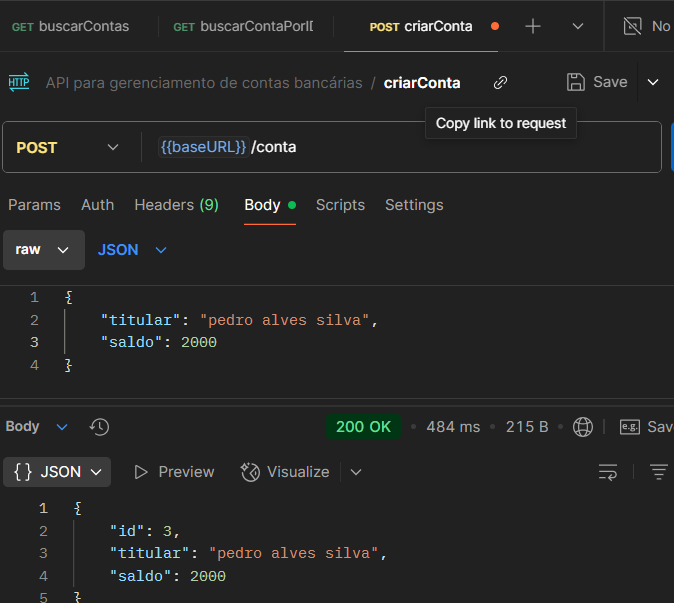
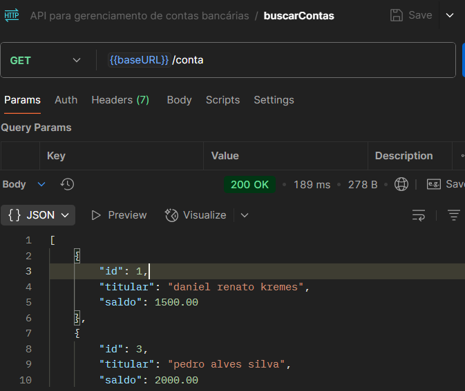
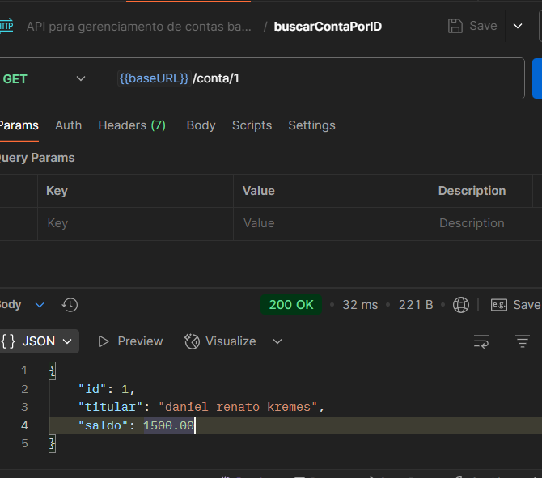

# API para gerenciamento de contas bancárias com operações de depósito, saque e consulta de saldo

# Tecnolgias usadas no projeto
- Docker Compose: para fazer nosso modelo de banco de dados (Optei pelo postgres)
- JPA: para persistencia de dados 
- Postgres: Banco de Dados Relacional
- 

## Cadastrar Conta

## Listas todas as contas

## Listar contas por id

# Ultima atualização 
- 23/07/2025