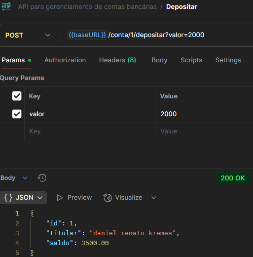
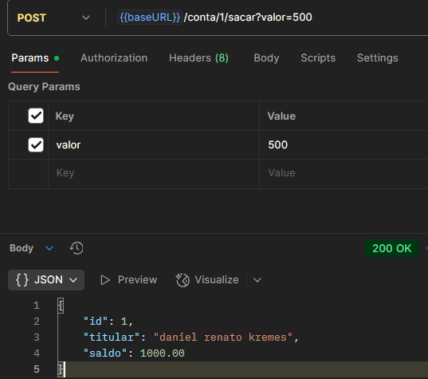
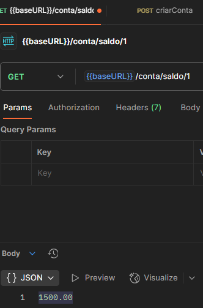

# 🏦 API de Gerenciamento de Contas Bancárias

API REST desenvolvida para realizar operações básicas de contas bancárias, como cadastro, depósito, saque e consulta de saldo.

---

## 🚀 Tecnologias Utilizadas

- **Java + Spring Boot**: Framework principal para criação da API REST.
- **JPA (Hibernate)**: Persistência de dados e mapeamento objeto-relacional.
- **PostgreSQL**: Banco de dados relacional para armazenar as contas.
- **Docker Compose**: Orquestração dos serviços (banco de dados e aplicação).

---

## 📌 Funcionalidades

- ✅ Cadastro de contas bancárias
- ✅ Listagem de todas as contas
- ✅ Consulta de conta por ID
- ✅ Depósito em conta
- ✅ Saque de valores
- ✅ Consulta de saldo

---

## 📸 Exemplos de Uso

### ✅ Cadastrar Conta

---

### 📄 Listar Todas as Contas

---

### 🔍 Consultar Conta por ID

---

### 💰 Depositar em Conta (necessário ID)

**Antes do depósito:**  

**Depois do depósito:**  

---

### 💸 Sacar da Conta (necessário ID)

**Antes do saque:**  

**Depois do saque:**  

---

### 💳 Consultar Saldo

---

## 📅 Última Atualização

- **24/07/2025**
